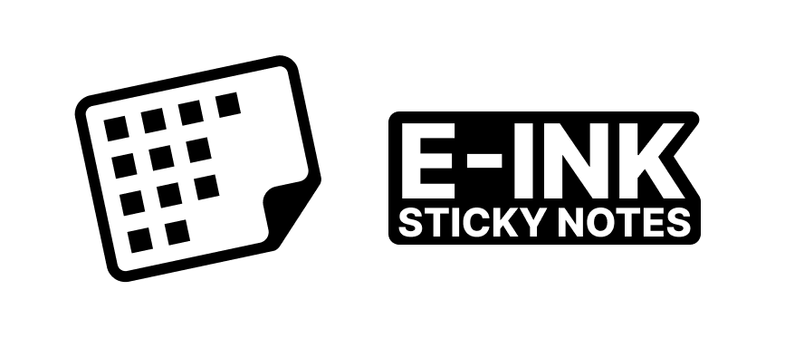

# E-ink Sticky Notes



E-ink sticky notes showing up-to-date status of tasks, focused on GitHub PRs and customer support Slack threads.

The project has been on my mind for a while, but I started working on it during the [lofi hack](https://lofihack.com/) on Feb 22, 2025

## The idea

A lot of my work is async. I often have to pause tasks to wait for customers to respond or for a co-worker to review my PR. I tried sticky notes to manage my tasks, but they get outdated too quickly. Notion made it easier to keep their status up-to-date, but it’s still a manual process, and I miss having physical sticky notes to represent my tasks.

This project’s goal is to create a hybrid between physical and digital task management. The digital side is a local-first auto-updating dashboard, while the physical side are e-ink displays where each of them would have a single task assigned to them.

The idea is to have five to ten e-ink sticky notes on my desk. As I start my work, I’ll pick which tasks to focus for the day, each of them will be displayed on their own e-ink sticky note. Then I can arrange the tasks as I see fit, whether I’m creating piles by importance, separating coding and customer tasks, or putting them in the order I want to tackle them. As I finish a task, I can physically inspect my tasks to see if any of them is now unblocked, or if I should ping someone about them.

Lastly, placing the e-ink sticky note on a base would start my timer for that task, potentially opening a window letting me navigate to the relevant PR or Slack thread.

## Useful commands

#### Start the dashboard

```bash
npm run dev
```

#### Start server that communicates with the e-ink devices

```bash
npm run dev:server
```

#### Copy circuitpython files to the e-ink device

```bash
# Copy once
npm run copy

# Watch for changes to code.py
npm run dev:magtag
```

#### Logs from the e-ink display

```bash
npm run logs:magtag
```

#### Commands TODOs

- [ ] Run all dev commands in parallel

## Devices

I've been using a [MagTag](https://www.adafruit.com/product/4800), but they've been out of stock for a while. I also had a [Lilygo T5 e-paper](https://lilygo.cc/products/t5-4-7-inch-e-paper-v2-3) with me, but I found it too big, so I haven't even booted it yet.

There are a number of alternatives. I'll update this repo if I try another option (which I'll need to, in order to have 5-10 devices)

## Lofi Hack

Here's the hackathon website: https://lofihack.com. During the event I managed to build a simple dashboard, but I didn't get to get the e-ink display showing the graphics I wanted.

## Created with

Created using [create-lofi-app](https://www.npmjs.com/package/create-lofi-app)
